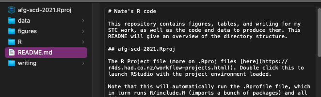
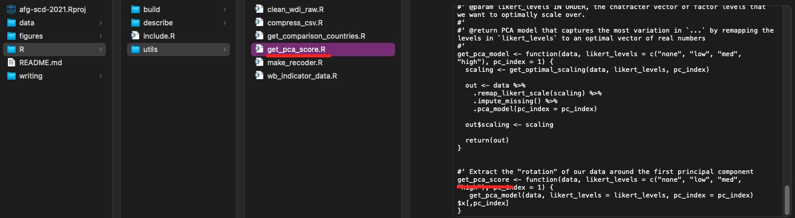
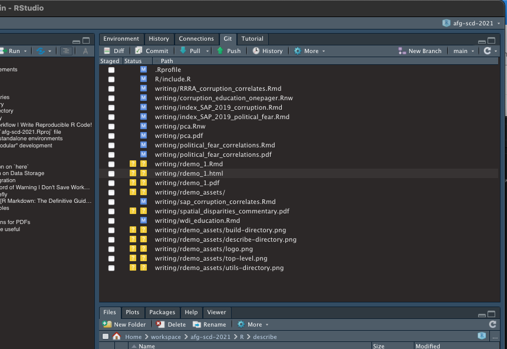

```{r setup, include=FALSE}
library(here)
here::i_am("writing/rdemo_1.Rmd")
knitr::opts_chunk$set(echo = TRUE, eval=FALSE)
```

## Agenda

- Software Requirements
- Project Structure
- Notes on workflow
- Some R Markdown

# Software Requirements

## R and RStudio

-   At least R 4.0.0, RStudio 1.4.0 recommended
-   No breaking changes afaik, but best to keep your software fresh
-   No need to install particular R packages, we will bootstrap with `librarian` (discussed later)

## Git et al.

-   `git` install on your local machine (you likely already have it)

-   In addition, this project uses [`git-lfs`](https://git-lfs.github.com/) for large file storage

    -   You only need to download and it should work automatically

# Project Structure

## Top-level Directories

- Separate folders for R code, data, figures, and writeups
- Where possible, include README.md files as well as comments in your code to help others (and a future version of yourself) understand its purpose



## R `build` Directory

- `build` directory contains code that compiles "cleaned" datasets
- Name of file should correspond to name of output `.csv.gz` file in data/


## R `describe` Directory

- `describe` directory contains code for analysis, writeup, and making figures
- Filenames starting with "graph" output figures and the names correspond to filenames in figures/
- Other code is meant to be included as part of a writeup, and may generate `LaTeX` output using the `kbl` package


## R `utils` Directory

- `utils` contains utility functions that I want to use in other places
- Filenames correspond to the exported function
- Files in this directory are sourced in `.Rprofile`



# Suggested R Workflow | Write Reproducible R Code!

## Double click the `afg-scd-2021.Rproj` file
### R Projects are standalone environments
- Runs `.Rprofile` on startup—it loads your packages!
- Nice RStudio git integration

### Encourages "modular" development
- Don't pollute your workspace with stuff from other projects!
- `.Rproj` files are loaded in a new RStudio instance

## `.Rprofile`
- Startup script a la `.bashrc` and others
- It just sources things
```{r, code = readLines(here(".Rprofile"))}
```

## `R/include.R` 
- Uses [`librarian::shelf`](https://cran.r-project.org/web/packages/librarian/vignettes/intro-to-librarian.html), which will automatically download packages for you if you don't have them
- Also does assorted business like set up [logging](http://logging.r-forge.r-project.org/sample_session.php) and calls [`here::i_am`](https://here.r-lib.org/)

### Quick Digression on `here`
- Once your RStudio starts up, you will see a message like this:
  - here() starts at /Users/nate/workspace/afg-scd-2021
- `here` should be used throughout the project to make referring to files easier!
  - See example usage below for reading a data file (`R/describe/index_SAP_2019_corruption.R`):
```{r, code = c(readLines(here("R/describe/index_SAP_2019_corruption.R"))[1], "[...]")}
```

## Quick Digression on Data Storage
- `.csv.gz` is preferred storage format
  - Other storage types are included in `.gitignore`, including `.dta`, `.csv`, `.xlsx`
  - You can unzip to a `.csv` and inspect with Excel if you like
  - Can even edit and save and use my `compress_csv` utility function to write back to `.csv.gz`
  - Editing as per above is HIGHLY DISCOURAGED given it is not reproducible
- [`vroom`](https://github.com/r-lib/vroom#vroom-) package is the new standard in reading delimited files
  - Can read and write directly to compressed file types with great throughput
  - Uses multiple threads, lazy access

## RStudio Git Integration
- Good GUI for git interaction imo
  - Handle commits, pulls, pushes, diffs, and reverts easily
  - Can even selectively stage certain portions of a file for commit!



## And Finally, A Word of Warning | Don't Save Workspace Data
- When you exit RStudio, you are presented with a dialog box asking if you would like to save your workspace data
- Do NOT save your workspace data, ever!
- It is antithetical to the concept of reproducible research
- It is even included in `.gitignore` (for good reason!)

# RMarkdown, Briefly | `.Rmd` and `.Rnw`

## Read the Book | [R Markdown: The Definitive Guide](https://bookdown.org/yihui/rmarkdown/)
- Yihui Xie also has good resources on his personal website
- Uses markdown (`.md`) syntax combined with a "knit" process that renders embedded R code chunks
  - Options to display either the code itself, output, both, or neither.
  - [Cheatsheet to get started](https://rmarkdown.rstudio.com/lesson-15.HTML)

### Figures and Tables
- Any calls to `ggplot` will be included—here are some [figure options](https://bookdown.org/yihui/rmarkdown/html-document.html#figure-options)
- `kableExtra` is a nice package for tables. Here's a guide for [HTML](https://cran.r-project.org/web/packages/kableExtra/vignettes/awesome_table_in_html.html) and [LaTeX](https://haozhu233.github.io/kableExtra/awesome_table_in_pdf.pdf)

## Output Formats
- Dizzying array of output formats, from HTML to PDF to interactive notebooks, Word documents, Powerpoint documents, HTML5 slides, dashboards, Shiny apps, books, and even entire websites.
- This document is an [ioslides presentation](https://bookdown.org/yihui/rmarkdown/ioslides-presentation.html), but I want to focus on [HTML](https://bookdown.org/yihui/rmarkdown/html-document.html) and [PDF](https://bookdown.org/yihui/rmarkdown/pdf-document.html) outputs
- Both output types use `pandoc`, which is a tool for converting between documents of different languages
  - You can embed HTML in an `.Rmd` file you intend to knit to HTML, and you can embed TeX code in one you will knit to PDF
  - For example, this start below is made with HTML code:
<svg height="210" width="500">
  <g transform="translate(100, -40) scale(.75) rotate(30)">
    <polygon points="100,10 40,198 190,78 10,78 160,198" style="fill:yellow;stroke:black;stroke-width:5;fill-rule:nonzero;"/>
    Sorry, your browser does not support inline SVG.
  </g>
</svg>

## Alternative Options for PDFs
- There is a tool called `Sweave` for working directly with LaTeX
- Has file extension `.Rnw` (which confusingly stands for "R noweb" after Donald Knuth's famous noweb)
- Here is a [quick intro](https://rpubs.com/YaRrr/SweaveIntro)

### Why this may be useful
- If you are proficient with LaTeX you may prefer to write the report in TeX rather than markdown
  - Full control over cites, floats, spacing, etc.
- I use Visual Studio Code to edit `.Rnw` files
  - Shameless plug for [LaTeX workshop](https://marketplace.visualstudio.com/items?itemName=James-Yu.latex-workshop) VS code extension, which has amazing [snippets](https://github.com/James-Yu/LaTeX-Workshop/wiki/Snippets#snippets-and-shortcuts) and [tools](https://github.com/James-Yu/LaTeX-Workshop/wiki/Compile#building-a-rnw-file) for building different `.Rnw` files
  
## Recap
- You need to install `git-lfs`
- Practice good R project hygiene
- R Markdown is a great way to make reproducible reports
  - Learn some HTML or LaTeX at the same time!

<svg height="220" width="500" style="float:right;margin-right:-15%">
	<g transform="translate(150, 125)">
    	<circle cx="0" cy="0" fill="yellow" stroke="black" r="90" stroke-width="5" />
    </g>
	<g transform="translate(105, 100)">
  		<circle id="eye" cx="0" cy="0" fill="black" r="10"/>
    </g>
    <g transform="translate(195, 100)">
    	<use xlink:href="#eye"/>
    </g>
    <g transform="translate(110, 150)">
    	<path d="M 0,0
        		 Q 40,50 80,0" stroke="black" fill="none" stroke-width="5"/>
    </g>
</svg>
