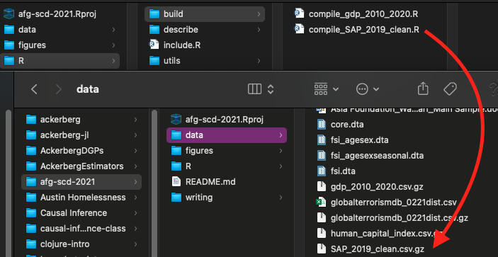
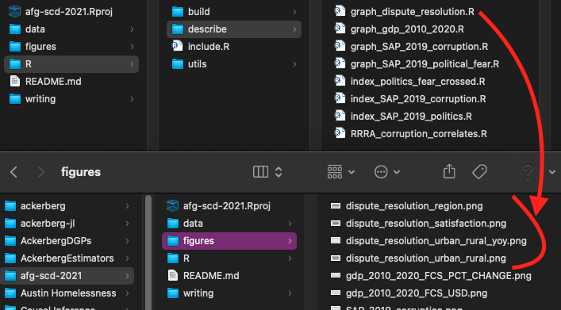
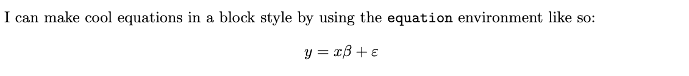

```{r setup, include=FALSE}
library(here)
here::i_am("writing/rdemo_1.Rmd")
knitr::opts_chunk$set(echo = TRUE, eval=FALSE)
```

## Agenda

- Software Requirements
- Project Structure and Setup
- Some LaTeX
- Some R Markdown

### Note on these slides

- These are all in the GitHub repository that I set up for this project. Look in the writing folder for the rdemo .Rmd and .html files

# Software Requirements

## {.smaller}

### R and RStudio

-   At least R 4.0.0, RStudio 1.4.0 recommended
-   Follow the instructions [here](https://www.rstudio.com/products/rstudio/download/#download) to download R and RStudio

### Git and GitHub

-   `git` is a command-line tool for version control. GitHub is a remote repository where you can store git projects.
    - Most computers these days come with git already installed
-   You will need to create an account with GitHub and configure `git` with your GH credentials
    - Multiple ways of doing this: comprehensive documentation [here](https://docs.github.com/en/authentication/keeping-your-account-and-data-secure/about-authentication-to-github)
    - I used [GitHub CLI](https://cli.github.com/) (command-line interface) recently and liked it
      - Download and run `gh auth login` followed by `gh auth setup-git`
      
### LaTeX

- Typesetting software, aka "Fancy Word"
- "If Microsoft Word were a programming language"
- Download [here](https://www.latex-project.org/get/), unfortunately it's 7 GB of stuff

# Projects in R

## Start with an .Rproj File
- Contains project-level configuration settings
- You can launch RStudio by double-clicking on the `.Rproj` file

### Encourages "modular" development
- Opens one window per project
- Avoid having stuff from one project in your workspace

## `.Rprofile`
- One of a number of "special" R files, [here's a list of them](https://support.rstudio.com/hc/en-us/articles/360047157094-Managing-R-with-Rprofile-Renviron-Rprofile-site-Renviron-site-rsession-conf-and-repos-conf)
- Startup script which runs when you load a project
- I use it to load all of the packages that I want to use.
- This is what is in my `.Rprofile` file:
```{r, code = readLines(here(".Rprofile"))}
```

## `R/include.R` 
- Uses [`librarian::shelf`](https://cran.r-project.org/web/packages/librarian/vignettes/intro-to-librarian.html), which will automatically download packages for you if you don't have them
  - FYI, recently had to do a clean install on a computer and ran into issues with the `systemfonts` package
  - If you're having issues, I recommend installing this separately and NOT building from source when given the option
- Also calls [`here::i_am`](https://here.r-lib.org/) so set up the `here` package

## `here` are my files
- Once your RStudio starts up, you will see a message like this:
  - here() starts at /Users/nate/workspace/causal-inference-2022
  - This is the `here::i_am` call
- Afterwards you can use the `here` function to reference file paths relative to the root of your project
  - If you'd ever struggled with relative/absolute paths in a project you will know how awesome this is
- `here` should be used throughout the project to make referring to files easier
  - See example usage below for reading a data file (`R/build/NLSY97_clean.R`):
```{r, code = c(readLines(here("R/build/NLSY97_clean.R"))[6], "[...]")}
```

---


- Let's set up a project from scratch in RStudio

## Directory Structure

- Separate folders for your R code, tables, figures, and any papers that you write

## R `build` Directory

- `build` directory contains code that compiles "cleaned" datasets
- Name of file should correspond to name of output `.csv` file in data/

{width=40%, height=40%}

## R `output` Directory

- `output` directory contains code that generates figures and tables
- Filenames starting with "figure" output figures and the names correspond to filenames in figures/
- Filenames starting with "table" output tables with either `kbl` or `stargazer` that are stored as .tex files in the tables/ folder

{width=60%, height=60%}

## `writing` directory

- Here is where you write your paper as a .tex file (more on LaTeX in a second)
- Any additional one-pagers or slides could go in here
- Use my `paper.tex` file as a guide for your own report
- These slides are also in my `writing` directory

## Workflow using your workspace
- Your workspace is a place to test things out
- Type code in your console and see if it works
- Once it works, WRITE IT DOWN in a file!
- Don't save your workspace data when you close RStudio

# Some LaTeX

## Resources

- Overleaf has a guide at [https://www.overleaf.com/learn](https://www.overleaf.com/learn)
- There is a WikiBook on LaTeX at [https://en.wikibooks.org/wiki/LaTeX](https://en.wikibooks.org/wiki/LaTeX)

## Shameless Plug for Visual Studio Code

- I use VS Code to edit LaTeX using the [LaTeX workshop](https://marketplace.visualstudio.com/items?itemName=James-Yu.latex-workshop), which has amazing [snippets](https://github.com/James-Yu/LaTeX-Workshop/wiki/Snippets#snippets-and-shortcuts) and [tools](https://github.com/James-Yu/LaTeX-Workshop/wiki/Compile) for building different types of files
- VS Code is a general-purpose IDE (integrated development environment) where you can write code in any programming language
{width=80%, height=80%}

## Preamble {.smaller}
- Start with `\documentclass{article}` (or another documentclass like book or report—see the list [here](https://en.wikibooks.org/wiki/LaTeX/Document_Structure))
- Load packages that you need for your PDF
  - Below are some packages in my `paper.tex` file
  - Normally I just copy-paste from the last .tex file I wrote...
- You also put the title, author, etc. of your paper here using, e.g. `\title{My Paper}`

```{tex, code = c(readLines(here("writing/paper.tex"))[2:11],"","[etc...]")}
```

## The Document {.smaller}
- Write your paper after `\begin{document}` and before `\end{document}`
- As far as things you should know, equations, figures, and tables will suffice
- Read my `paper.tex` file, which should be treated as a brief tutorial of all the commands you need for this assignment. Here is an example of the LaTeX above and the output below:
```{tex, code = readLines(here("writing/paper.tex"))[47:50]}
```
{width=80%, height=80%}

- Advanced users: Check out the [subfiles](https://www.overleaf.com/learn/latex/Multi-file_LaTeX_projects) package for working with large projects

# RMarkdown, Briefly | `.Rmd` and `.Rnw`

## Read the Book | [R Markdown: The Definitive Guide](https://bookdown.org/yihui/rmarkdown/)
- Yihui Xie also has good resources on his personal website
- Uses markdown (`.md`) syntax combined with a "knit" process that renders embedded R code chunks
  - Options to display either the code itself, output, both, or neither.
  - [Cheatsheet to get started](https://rmarkdown.rstudio.com/lesson-15.HTML)

### Figures and Tables
- Any calls to `ggplot` will be included—here are some [figure options](https://bookdown.org/yihui/rmarkdown/html-document.html#figure-options)
- `kableExtra` can generate pretty HTML and LaTeX tables. Here's a guide for [HTML](https://cran.r-project.org/web/packages/kableExtra/vignettes/awesome_table_in_html.html) and [LaTeX](https://haozhu233.github.io/kableExtra/awesome_table_in_pdf.pdf)

## Output Formats
- Dizzying array of output formats, from HTML to PDF to interactive notebooks, Word documents, Powerpoint documents, HTML5 slides, dashboards, Shiny apps, books, and even entire websites.
- This document is an [ioslides presentation](https://bookdown.org/yihui/rmarkdown/ioslides-presentation.html), but I want to focus on [HTML](https://bookdown.org/yihui/rmarkdown/html-document.html) and [PDF](https://bookdown.org/yihui/rmarkdown/pdf-document.html) outputs
- Both output types use `pandoc`, which is a tool for converting between documents of different languages
  - You can embed HTML in an `.Rmd` file you intend to knit to HTML, and you can embed TeX code in one you will knit to PDF
  - For example, this star below is made with HTML code:
<svg height="210" width="500">
  <g transform="translate(100, -40) scale(.75) rotate(30)">
    <polygon points="100,10 40,198 190,78 10,78 160,198" style="fill:yellow;stroke:black;stroke-width:5;fill-rule:nonzero;"/>
    Sorry, your browser does not support inline SVG.
  </g>
</svg>

## Alternative Options for PDFs
- There is a tool called `Sweave` for working directly with LaTeX
- Has file extension `.Rnw` (which confusingly stands for "R noweb" after Donald Knuth's famous noweb)
- Here is a [quick intro](https://rpubs.com/YaRrr/SweaveIntro)

## So should I do LaTeX or RMarkdown?
- I love RMarkdown and think it is suited to many use cases
- One where I think LaTeX is better is for large, multi-file projects
- Force you to use LaTeX for this assignment, but you could write your entire research paper in RMarkdown if you really wanted

  
## Recap
- Make a GitHub account
- Create an R Project in a GH Repository
- Be a disciplined coder
- Learn some LaTeX

### Next time...
- Tidy data
- Plotting
- Functional Programming

### Next, next time...
- Assorted helpful things
