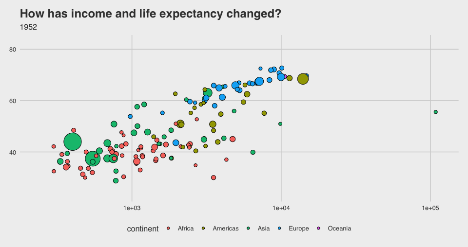
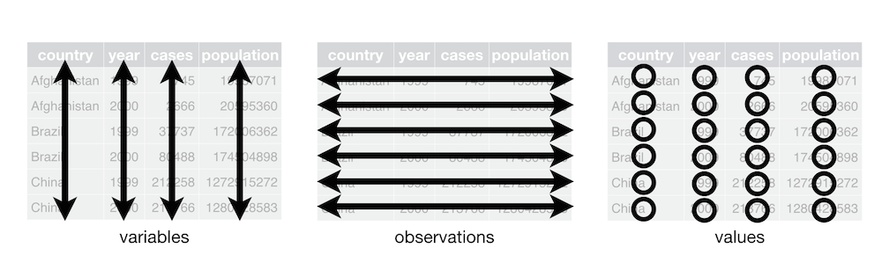
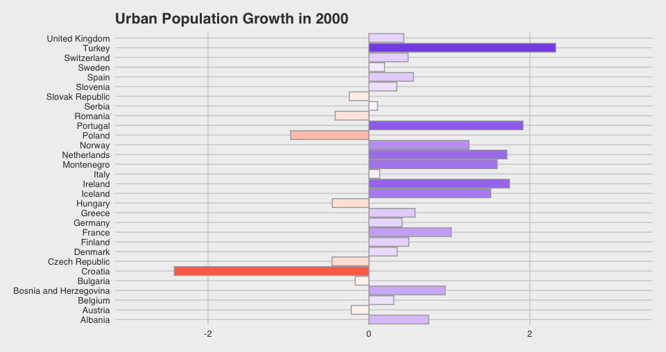

```{r setup, include=FALSE}
knitr::opts_chunk$set(echo = TRUE, eval=TRUE, fig.align = "center", fig.width=10, fig.height=5.3)
library(knitr)
library(here)
here::i_am("writing/rdemo_2.Rmd")
source(here("R/include.R"))
# the below code makes plots show up on separate slides from the code that generates them
local({
  hook_plot = knit_hooks$get('plot')
  knit_hooks$set(plot = function(x, options) {
    paste0('\n\n----\n\n', hook_plot(x, options))
  })
})
```

## Resources
- These slides are based heavily on portions of two books:
  - [R for Data Science](https://r4ds.had.co.nz/) (Beginner to Intermediate)
    - Hadley Wickham and Garrett Grolemund; 1st edition, revised 2020
  - [Advanced R](https://adv-r.hadley.nz/) (...advanced, but a fantastic book)
    - Hadley Wickham; 2nd edition, 2019
    
## Hadley Appreciation Slide
- Hadley Wickham is "Chief Scientist" at RStudio
- Author of many [tidyverse](https://www.tidyverse.org/) core packages


- Has good talks on YouTube, e.g. [here](https://www.youtube.com/watch?v=9YTNYT1maa4) and [here](https://www.youtube.com/watch?v=bzUmK0Y07ck)

## First Some Context
- There is a deeper philosophy underlying the concepts of tidy data and visualization
- United by the concept of functional programming (FP)
  - I want to give context before we dive into `ggplot` and `dplyr`
  - Supplemental reading in [Advanced R](https://adv-r.hadley.nz/fp.html) and package docs for [purrr](https://purrr.tidyverse.org/)

## FP Building Block: Pure Functions {.smaller}
- Focus on <b>pure functions</b>
  - a.k.a. side-effect free, same input same output
  - Functions should be small. They should do one and exactly one thing.
- This function is pure:
```{r}
pure_function <- function(x) x + 3
```
- This function is not pure because it relies on a global variable. I can change `y` and change the behavior of the function.
```{r}
y <- 3
impure_function <- function(x) x + y
```

## Advanced R, quote about Functional Programming (emphasis added)

> It’s hard to describe exactly what a functional style is, but generally I think it means decomposing a <b>big problem</b> into <b>smaller pieces</b>, then solving each piece with a function or combination of functions. When using a functional style, you strive to <b>decompose</b> components of the problem into <b>isolated functions</b> that operate <b>independently</b>. Each function taken by itself is simple and straightforward to understand; <b>complexity</b> is handled by <b>composing</b> functions in various ways.

- R is actually a very technically advanced FP language
  - [Everything is a function](https://adv-r.hadley.nz/functions.html#function-forms), [function arguments are lazily evaluated](https://adv-r.hadley.nz/functions.html#lazy-evaluation), [R has non-standard evaluation](https://adv-r.hadley.nz/metaprogramming.html) (an extraordinarily unique feature)

## What's the point of FP? {.smaller}
- Focus on function composition allows you to separate the "pipeline" from the "data"
- Let's compute $f(x) = \exp\left(\sqrt{x^2 + 3}\right)$. The "data" is $x$—the "pipeline" is the set of functions that we apply
```{r}
square <- function(x) x^2
add3 <- function(x) x + 3
f <- . %>% square %>% add3 %>% sqrt %>% exp
f(2)
```
- This idea of function pipelining captures the essence of functional programming

## The Pipe Operator

- The pipe operator from `magrittr` is a key part of our FP toolkit
  - `x %>% f` and `x %>% f()` get translated to `f(x)`
  - `x %>% f(y)` gets translated to `f(x,y)`
  - `. %>% f %>% g` gets translated to `function(x) g(f(x))`
- As academics who produce reports, we can think of R scripts as pipelines that operate on our saved data files and produce <b>some</b> output: a figure, another dataset, an R markdown file...
  - In a sense, our R scripts should look like one long string of pipes! We take our data and pipe it through a series of small, pure functions and wind up with our output.
  
## If you think this is cool

- Read the section of Advanced R on functional programming [here](https://adv-r.hadley.nz/fp.html)
- Listen to Hadley's keynote on Functional Programming [on YouTube](https://www.youtube.com/watch?v=bzUmK0Y07ck)
- [Learn](http://learnyouahaskell.com/introduction) the Haskell Programming Language

# `ggplot2`

> “The simple graph has brought more information to the data analyst’s mind than any other device.” — John Tukey

>     — Hadley Wickham

## The gg stands for "grammar of graphics"
- Map columns of your dataset to features of a graph. Here's a template:
```{r, eval = FALSE}
ggplot(data = <DATA>) + 
  <GEOM_FUNCTION>(mapping = aes(<MAPPINGS>)) +
  [scale adjustments, labels, legend, theme, etc...]
```
### References 
- Chapter 3 in [R for Data Science](https://r4ds.had.co.nz/data-visualisation.html)
- A [cheatsheet](https://github.com/rstudio/cheatsheets/raw/main/data-visualization-2.1.pdf) from RStudio
- [The R Graph Gallery](https://www.r-graph-gallery.com/)
- The [ggplot book](https://ggplot2-book.org/index.html)

This section is going to build plots using the `gapminder` dataset (world population, life expectancy, and GDP/capita over time)

## Gapminder dataset {.smaller}
- Here is a snippet:
```{r}
library(gapminder)
set.seed(12345) # set pseudorandom number generator's seed for reproducibility
gapminder %>% sample_n(10)
```

## Basic Scatterplot 
- Let's try and visualize the relationship between GDP and life expectancy
  - Take 1: scatterplot
  - `aes` controls the "aesthetic mapping" between columns of your dataset and parts of the graph
```{r, fig.cap="Basic scatterplot"}
ggplot(gapminder) +
  geom_point(aes(x = gdpPercap, y = lifeExp))
```

## Slightly Improved Scatterplot 
- This is a panel dataset, so we probably don't want to display data for all years
  - In grammar of graphics, the year is another "dimension" we could map to an aesthetic feature
  - For now, let's just filter the data and choose one year
- Coding footnotes
  - Slightly annoyingly, we use `%>%` for the data pipeline and `+` to combine ggplot components
  - Also note that the `aes` call can either go in `ggplot` or in the individual `geom` functions. I prefer the former.
```{r, fig.cap="Scatterplot with only one year"}
gapminder %>%
  filter(year == 2002) %>%
  ggplot(aes(gdpPercap, lifeExp)) +
    geom_point()
```

## You can include multiple geometries 
- To illustrate, you can include more than one geometry in a plot
  - This plot adds a second geometry, `geom_smooth`, which plots a best fit line
- Coding footnotes
  - The first two arguments to `aes` are always x and y, so you don't need to put `x = ` to specify the argument.
```{r, fig.cap="Plot with two geometries"}
gapminder %>%
  filter(year == 2002) %>%
  ggplot(aes(gdpPercap, lifeExp)) +
    geom_point() +
    geom_smooth()
```


## Let's add some color
- Looking in the documentation for `geom_point`, we see that there are 9 different aesthetic mappings we could use: color (outline) or fill of the point, its size, its transparency (alpha), etc.
- Let's map fill (aka color) onto the continent and size to the population
```{r, fig.cap="Mapping more aesthetics"}
gapminder %>%
  filter(year == 2002) %>%
  ggplot(aes(gdpPercap, lifeExp, fill = continent, size = pop)) +
    geom_point(pch = 21, color = "black")
```

---

- You can see that aesthetics are treated differently depending on whether they are <b>categorial</b> (like continent) or <b>continuous</b> (like population)
- `ggplot` tries to pick sensible defaults
  - Which colors to use for which continents
  - What size to use for what population
  - Axis ticks for the x and y axes
- We can use "scale adjustments" to adjust how these aesthetics are mapped
  - Template: `scale_<AES_TYPE>_<SCALE_TYPE>(...)`
  - Example: I want 5 axis breaks on my x axis: 
```{r, eval=F}
[...] + scale_x_continuous(n.breaks = 5)
```
    
## Scale transformations, illustrated
- Let's use a log x scale. There's a function for that, `scale_x_log10`
- Let's also use a size scale transformation to make the points bigger
```{r, fig.cap="Log x scale, bigger points"}
gapminder %>%
  filter(year == 2002) %>%
  ggplot(aes(gdpPercap, lifeExp, fill = continent, size = pop)) +
    geom_point(pch = 21, color = "black") +
    scale_x_log10() +
    scale_size_continuous(range = c(2, 18))
```

## Faceting
- Another way we can display information in `ggplot` is by faceting, i.e. multiple subplots for each group in a categorical column
  - Can control number of rows/columns in output via `ncols`/`nrows` argument
  - Can control whether all subplots have the same x/y axis via `scales` argument
```{r, fig.cap="Choosing fixed or free scales is important when faceting"}
gapminder %>%
  filter(year == 2002) %>%
  ggplot(aes(gdpPercap, lifeExp, fill = continent, size = pop)) +
    geom_point(pch = 21, color = "black") +
    scale_x_log10() +
    scale_size_continuous(range = c(2, 18)) +
    facet_wrap(~continent)
```

## Labels and Legends
- Use the `labs` function to change axis labels, add titles, change legend labels, etc.
- Use the `guides` function to control what aesthetics get their own legends
```{r, fig.cap="Controlling labels and legends"}
gapminder %>%
  filter(year == 2002) %>%
  ggplot(aes(gdpPercap, lifeExp, fill = continent, size = pop)) +
    geom_point(pch = 21, color = "black") +
    scale_x_log10() +
    scale_size_continuous(range = c(2, 18)) +
    labs(x = "GDP/cap", y = "Life Expectancy", 
         title = "This graph is looking nice now", fill = "Region") +
    guides(size = "none")
```

## Themes
- There are built-in theme functions that start with `theme_XXX`—the `ggthemes` package provides even more. Some personal favorites are `theme_minimal`, `theme_fivethirtyeight`, `theme_calc`
```{r, fig.cap = "Experimenting with themes"}
gapminder %>%
  filter(year == 2002) %>%
  ggplot(aes(gdpPercap, lifeExp, fill = continent, size = pop)) +
    geom_point(pch = 21, color = "black") +
    scale_x_log10() +
    scale_size_continuous(range = c(2, 18)) +
    labs(x = "GDP/cap", y = "Life Expectancy", 
         title = "This graph is looking nice now", fill = "Region") +
    guides(size = FALSE) +
    theme_fivethirtyeight()
```


## Caveat on themes
- Whoops! It looks like the fivethirtyeight theme doesn't include axis labels
- Themes may override the "display style" of different elements
  - You may have to tinker with calls to `theme()` and plenty of Googling to fix these issues...
  - Just a heads up!
  
## Some random visualizations
- For illustrative purposes, here are some other ways I came up with to visualize these data
- First, population over time
  - Note that we use the `group` aesthetic in a line graph to make sure the right data points are connected
```{r, fig.cap="Line plot, facets don't help that much"}
ggplot(gapminder, aes(year, pop, group = country, color = continent)) +
  geom_point() +
  geom_line() +
  facet_wrap(~continent)
```

---

- There is a lot going on with that graph
  - I think it would be better to just aggregate by continent for a series plot
  - This requires some aggregation using `summarise` (more to come on this)
```{r, fig.cap = "This plot conveys something interesting"}
gapminder %>%
  filter(continent %in% c("Africa", "Europe", "Americas")) %>%
  group_by(continent, year) %>%
  summarise(population = sum(pop)) %>%
  ggplot(aes(year, population, color = continent)) +
    geom_point() +
    geom_line() +
    scale_y_log10()
```

## What about how GDP and life expectancy?

- I want to aggregate by continent, then facet and show GDP on one panel and life expectancy on the other panel
  
- This means that we need to pivot the data (more to come on this too)
- Here we want to `pivot_longer`
```{r, message=F}
plot_data <-
  gapminder %>%
    group_by(continent, year) %>%
    summarise(
      gdpPercap = weighted.mean(gdpPercap, pop),
      lifeExp = weighted.mean(lifeExp, pop)) %>%
    ungroup %>%
    pivot_longer(c(gdpPercap, lifeExp))
```

## What did `pivot_longer` do?

- Data before pivoting:
```{r, echo=FALSE, message=F}
gapminder %>%
  group_by(continent, year) %>%
  summarise(
    gdpPercap = weighted.mean(gdpPercap, pop),
    lifeExp = weighted.mean(lifeExp, pop)) %>%
  ungroup %>%
  head(2) %>%
  kbl() %>%
  kable_material()
```

---

- Data after pivoting:
```{r, echo=FALSE}
plot_data %>% head(4) %>% kbl %>% kable_material
```

## Now we have an aesthetic to map

- Given we have a `name` variable now, we can facet on it

```{r, fig.cap="Now prefer free y scale b/c GDP & lifeExp aren't comparable"}
ggplot(plot_data, aes(year, value, color=continent)) +
  geom_point() +
  geom_line() +
  facet_wrap(~name, scales="free_y") +
  scale_y_log10()
```

---

- Finally, I'll use the `gganimate` package  to make a gif
  - If you've seen any gapminder visualizations before, this is what you've seen:
```{r, cache=TRUE, eval=FALSE}
plot <- gapminder %>%
  ggplot(aes(gdpPercap, lifeExp, fill = continent, size = pop)) +
    geom_point(pch=21, color="black") +
    transition_time(year) + # from gganimate
    scale_x_log10() +
    scale_size_continuous(range=c(2, 18)) +
    guides(size = FALSE) +
    theme_fivethirtyeight() +
    labs(
      title = "How has income and life expectancy changed?", 
      subtitle = "{round(frame_time)}"
    )

anim_save("writing/rdemo_assets/animated.gif", plot)
```

---



# Data Manipulation and Tidy Data

> “Happy families are all alike; every unhappy family is unhappy in its own way.” — Leo Tolstoy

> “Tidy datasets are all alike, but every messy dataset is messy in its own way.” — Hadley Wickham

## Tidy Plots Require Tidy Data

- Data manipulation tools provided primarily by `dplyr` and `tidyr`
- References:
  - R for Data Science [Chapter 5](https://r4ds.had.co.nz/transform.html), [Chapter 12](https://r4ds.had.co.nz/tidy-data.html)
  - Vignettes for [`tidyr`](https://tidyr.tidyverse.org/articles/) and [`dplyr`](https://dplyr.tidyverse.org/articles/)
  - Cheetsheat on [data transformation](https://raw.githubusercontent.com/rstudio/cheatsheets/main/data-transformation.pdf) 
    - FYI, all cheetsheats are available at [https://www.rstudio.com/resources/cheatsheets/](https://www.rstudio.com/resources/cheatsheets/)
    
## What is Data Manipulation

- `filter`, `arrange`, `select`, `mutate`, `summarise`, `join`
- Going to quickly cover each of the above as well as pivoting
- Conclude with an example
- There is a lot here, strongly recommend going through the linked resources for a more thorough treatment

## Filter {.smaller}

- Reduce the number of rows in a dataset by removing rows for which a <b>predicate expression</b> is false
  - Remember, `filter` expects a <b>boolean vector</b> the same length as the dataset

```{r}
# what countries had less than 1m people in 1962?
gapminder %>% filter(pop < 1e6 & year == 1962) 
```

## Arrange {.smaller}

- Re-order the rows of a dataset based on the values in a column
  - Ascending order by default
  - Use `desc` for descending order

```{r}
# what were the five smallest countries in 1977?
gapminder %>% filter(year == 1977) %>% arrange(pop) %>% head(5)
```

## Select {.smaller}

- Select a subset of the columns of your data frame
```{r}
# what were the five smallest countries in 1977? just the countries
gapminder %>% filter(year == 1977) %>% arrange(pop) %>% head(5) %>% select(country)
```

---

- For advanced selection options search [tidy select](https://tidyselect.r-lib.org/reference/language.html)
```{r}
# select numeric columns except for `pop`
gapminder %>% select(where(is.numeric), -pop)
```

## Mutate {.smaller}

- Create new columns based on existing columns (or other R vectors in your workspace)
  - The new columns should be vectors the same length as your dataset
```{r}
# What were the top 5 GDP countries in 2002?
gapminder %>% 
  filter(year == 2002) %>%
  mutate(totalGDP = pop * gdpPercap) %>% 
  arrange(desc(totalGDP)) %>%
  select(country, pop:totalGDP) %>%
  head(5)
```

## {.smaller}

- Advanced usage includes the `across` verb
  - See dplyr's [colwise vignette](https://dplyr.tidyverse.org/articles/colwise.html) and [rowwise vignette](https://dplyr.tidyverse.org/articles/rowwise.html) for more info
  - You will need these in your assignment!
```{r}
# make log columns, perhaps for modeling. The {.col} is called "glue syntax"
gapminder %>%
  mutate(across(where(is.numeric), log, .names = "log_{.col}")) %>%
  head(5)
```

## Aggregate Data {.smaller}

- `summarise` (or `summarize`) data by one or more groups
  - More on grouping in [this article](https://dplyr.tidyverse.org/articles/grouping.html)
    - N.B. `group_by` also affects the behavior of mutate (discussed in linked article)
```{r}
# what continent had the highest GDP/cap in 1982?
gapminder %>%
  filter(year == 1982) %>%
  group_by(continent) %>%
  summarise(gdpPercap = weighted.mean(gdpPercap, pop)) %>%
  arrange(desc(gdpPercap))
```

## Join Two Tables Together {.smaller}

- If you've used SQL this should be familiar
  - Mutating joins are `inner_join`, `left_join`, `right_join`, `full_join`
  - Non-mutating ("inspecting") joins are `semi_join` and `anti_join`
- Use a common field to link data from two tables together in interesting ways
- Tutorial on joins in `dplyr` [here](https://dplyr.tidyverse.org/articles/two-table.html)

---

- Practical example: let's use the World Bank Population dataset to study European countries
```{r, cache=TRUE, warning = FALSE, message=FALSE}
data("world_bank_pop")
head(world_bank_pop, 3)
```
- Problem: there is no continent field in this data
  
## Solution

- Our `gapminder` data has a continent field, BUT it uses the full country name, not abbreviations!
- So we need an intermediate table, which is called country codes
```{r}
data("country_codes")
head(country_codes, 3)
```

## {.smaller}

- Now we can `filter` the `gapminder` dataset first, then use two inner joins to reduce the World Bank dataset to European countries
- Joins are very similar `filter` if you think about it
  - `gapminder` was reduced to a smaller dataset and then subsequent joins reduced the size of `country_codes` and then `world_bank_pop`

```{r}
gapminder %>%
  filter(continent == "Europe") %>%
  distinct(country) %>%
  inner_join(country_codes, "country") %>%
  inner_join(world_bank_pop, c("iso_alpha" = "country")) %>%
  sample_n(3)
```

## Pivoting Data {.smaller}

- tidyverse recently made the change from `gather`/`spread` to `pivot_longer`/`pivot_wider`
  - vignette on pivoting [here](https://tidyr.tidyverse.org/articles/pivot.html)
  - also info on second page of [data import cheatsheet](https://github.com/rstudio/cheatsheets/raw/master/data-import.pdf)
- Powerful and flexible way to reshape data sets
- Question: is this a tidy data set? How would you want this to look for plotting?
```{r}
world_bank_pop %>% select(1:10) %>% head(5)
```

## {.smaller}

- Is this a tidy data set? How would you plot this data?
  - Programming note: the `matches` function is a tidy select operator that matches columns via a regular expression. What is a regular expression? See [Chapter 14](https://r4ds.had.co.nz/strings.html) of R for Data Science.
```{r}
world_bank_pop %>% pivot_longer(matches("20\\d\\d"), "year")
```

## Hadley's Vision of Tidy Data



## So, Longer not Wider? {.smaller}

- Generally prefer long format for many things. There is some tradeoff
  - For example, if you want to make a pretty table, you may want a wider format
```{r}
gapminder %>%
  filter(year %>% between(1990, 2010)) %>%
  select(-continent) %>%
  filter(country == "Afghanistan") %>%
  select(-country) %>%
  pivot_longer(c(pop, gdpPercap, lifeExp)) %>%
  pivot_wider(names_from = year, values_from = value) %>%
  kbl(digits = 2) %>%
  kable_material()
```

## My Vision of Tidy Data {.smaller}

- Hard and fast rules like "variables should be columns and observations should be rows" distract from the end goal of tidying our data
  - <b>Which columns</b> will you map to <b>which aesthetics</b>?
- Let's illustrate by way of an example on the `world_bank_pop` dataset
  - Say we want to investigate urban population growth among European countries.

## {.smaller}

- First, need to use `gapminder` to create a filter on continent
- The "SP.URB.GROW" is the urban population growth indicator, which is what we care about
```{r}
urban_euros <- gapminder %>%
  filter(continent == "Europe") %>%
  distinct(country) %>%
  inner_join(country_codes, "country") %>%
  inner_join(world_bank_pop, c("iso_alpha" = "country")) %>%
  filter(indicator == "SP.URB.GROW")

urban_euros %>% 
  sample_n(2) %>%
  kbl(digits = 2) %>% 
  kable_material()
```

## What columns do you have? {.smaller}

- You have the name of the country, and then a column for each year
- If you try and map columns to parts of your graph, you can do interesting things
```{r, fig.cap = "Reordered the countries to make the graph more appealing"}
urban_euros %>%
  mutate(country = fct_reorder(country, `2000`)) %>%
  ggplot(aes(x = `2000`, y = country, fill = `2000`)) +
    geom_bar(stat="identity", color = "dark grey") +
    guides(fill = "none") +
    scale_fill_gradient2(
      low = "#FA2721",
      mid = "white",
      high = "#3607DE"
    ) +
    theme_fivethirtyeight() +
    labs(title="Urban Population Growth in 2000") +
    theme(plot.title = element_text(size = 16))
```

## Why isn't there a year column? {.smaller}

- In the end you're fundamentally limited by the lack of a year column
```{r}
urban_euros %>%
  pivot_longer(matches("20\\d\\d"), names_to = "year") %>%
  sample_n(3) %>%
  kbl(digits=2) %>%
  kable_material()
```

## This is why we tidy {.smaller}

- Tidying data is for the end goal of plotting
- Now we have a `year` column that we can map to an aesthetic.
  - I'll randomly draw three countries and do a series plot

```{r, echo=F}
set.seed(5678)
```
```{r, fig.cap = "This is the obvious thing to do, imo.", message=F}
plot_countries <- urban_euros %>% distinct(country) %>% sample_n(3)
urban_euros %>%
  inner_join(plot_countries) %>%
  pivot_longer(matches("20\\d\\d"), names_to = "year") %>%
  mutate(across(year, as.numeric)) %>%
  ggplot(aes(year, value, fill = country, group = country, color = country)) +
    geom_hline(yintercept = 0, color = "black") +
    geom_line(size=2, key_glyph = "timeseries") +
    geom_point(pch = 21, color = "black", size = 4) +
    theme_fivethirtyeight() +
    labs(title = "Urban Population Growth, Select Countries")
```


## We don't lose what we did before {.smaller}

- We could have made the same graph as we did earlier
  - All we need to do is filter the long dataset on `year == 2000` and replace the `2000` column with `value` 
```{r, eval = FALSE}
urban_euros %>%
  pivot_longer(matches("20\\d\\d"), names_to = "year") %>%
  mutate(across(year, as.numeric)) %>%
  filter(year == 2000) %>%
  mutate(country = fct_reorder(country, value)) %>%
  
  ggplot(aes(x = value, y = country, fill = value)) +
    geom_bar(stat="identity", color = "dark grey") +
    guides(fill = "none") +
    scale_fill_gradient2(
      low = "#FA2721",
      mid = "white",
      high = "#3607DE"
    ) +
    theme_fivethirtyeight() +
    labs(title="Urban Population Growth in 2000") +
    theme(plot.title = element_text(size = 16))
```

## We don't lose what we did before {.smaller}

- In fact you gain a dimension you can add to that plot—time!
```{r, cache=TRUE, eval=FALSE}
plot <- urban_euros %>%
  pivot_longer(matches("20\\d\\d"), names_to = "year") %>%
  mutate(across(year, as.numeric)) %>%
  ggplot(aes(x = value, y = country, fill = value)) +
    geom_bar(stat="identity", color = "dark grey") +
    transition_time(year) +
    guides(fill = "none") +
    scale_fill_gradient2(
      low = "#FA2721",
      mid = "white",
      high = "#3607DE"
    ) +
    theme_fivethirtyeight() +
    labs(title="Urban Population Growth in {round(frame_time)}") +
    theme(plot.title = element_text(size = 16))

anim_save("writing/rdemo_assets/animated-2.gif", plot)
```

---



## Recap

- Our artistry and "aesthetic" comes through in discovering ways to map columns of our data to aspects of a graph
  - [R Graph Gallery](https://www.r-graph-gallery.com/) has some good inspiration
  - [The Visual Display of Quantitative Information](https://www.edwardtufte.com/tufte/books_vdqi) is considered a classic book
    - It also makes a nice coffee table book
  - Consume media that has good graphs—FiveThirtyEight, Vox, NY Times (many others) are all great
- Data transformation and tidying is the toolkit that enables visualization
- Functional Programming is the mindset that epitomizes data transformation and tidying
- You'll notice that <b>all</b> of the data manipulation I do in my scripts is via `dplyr` and `tidyr` verbs. This should be your goal as well!

## Assignment

- At this point you should be able to do your assignment
  - Is there any clarification that would be helpful at this point?
  - Don't hesitate to message me on Discord or email me at nhattersley@utexas.edu

### Next time

- Random helpful tidyverse packages
- Attendance is optional, but if you're interested in R it's highly encouraged