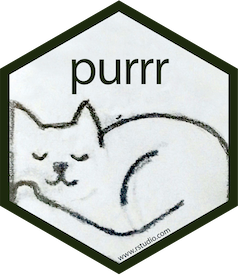
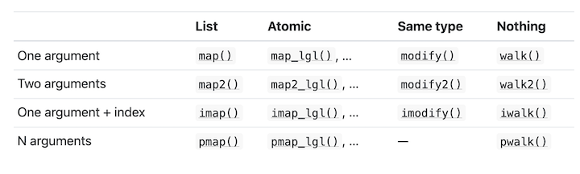

```{r setup, include=FALSE}
library(here)
here::i_am("writing/rdemo_3.Rmd")
knitr::opts_chunk$set(echo = TRUE, eval=FALSE)
```

# `purrr` 

## For hardcore (and not so hardcore) functional programmers

- [Docs](https://purrr.tidyverse.org/) and [cheatsheet](https://github.com/rstudio/cheatsheets/blob/master/purrr.pdf)
- Introduces "lambda" syntax for more easily creating functions
- Introduces `map_*` family of functions to replace `lapply`, `sapply`, et al.
- Assorted other functions to make your code sleek and functional
- Standard cite for functional programming in R is Advanced R [chapters 9--11](https://adv-r.hadley.nz/fp.html)

## Lambdas | interesting (ab)use of R formulas {.smaller}

- R formulas are unevaluated, just one aspect of the language's non-standard evaluation
  - The variables `outcome`, `treatment`, `control`, and `instrument` are not defined below, but we can still create this formula object:
```{r, eval = T}
outcome ~ treatment + control | instrument
```
- Someone smart realized that formulas can be used as a shorthand for functions
  - `rlang`'s [`as_function`](https://rlang.r-lib.org/reference/as_function.html) converts a one-sided formula to function
```{r, eval = TRUE}
f <- rlang::as_function(~ .x + 2)
f(3)
```

## Lambdas | usage in `tidyverse` {.smaller}

- You can use `.x` and `.y` to refer to the first two arguments, `..1`, `..2`, etc. if you have more than two arguments
- For example, to take the weighted mean of the first five columns of your data, using the `weight` column as a weight:
```{r}
data %>% mutate(across(1:5, ~weighted.mean(.x, weight)))
```
- Throughout the documentation for `tidyverse` you will see that you can use `purrr`-style lambdas anywhere you could use a function

## Map family {.smaller}

- Another primary usage for lambdas is in the `map_` family of functions in `purrr`
- Pass in your data (as a list, vector, data.frame, etc.) and a function to apply to each element of your data
  - `purrr` will return a list by default, but there is a function, e.g. `map_chr`, to return a character vector
  - There are also variants for the number of input arguments
- Example:
```{r, eval = T}
data <- tibble(flavor = c("Chocolate", "Vanilla"), topping = c("almonds", "strawberries"))
data %>% mutate(
  description = map2_chr(flavor, topping, ~paste(.x, "ice cream with", .y, "on top"))
)
```
## {.smaller}

- N.B. `map2_chr` is not strictly necessary here, as you could have written:
  - `description = glue("{flavor} ice cream with {topping} on top")` (more on `glue` later)
  - using `map_*` may seem superfluous in a vectorized language, but it is necessary in situations where your functions are not properly vectorized!
  
-Here is how Advanced R (section 9.4) organizes the map family: by number of arguments (rows), and by return type (columns)



## Other assorted stuff in `purrr` {.smaller}

- [Other list operations](https://purrr.tidyverse.org/reference/index.html#section-other-vector-transforms) such as `reduce`, `accumulate`, and `flatten`
- Do things with [predicate functionals](https://purrr.tidyverse.org/reference/index.html#section-predicate-functionals)
- Modify function behavior using higher-order [adverbs](https://purrr.tidyverse.org/reference/index.html#section-adverbs)
  - Example:
```{r, eval = TRUE}
# instead of THROWING an error, return a list that contains the error object itself
safely_sqrt <- safely(sqrt)
safely_sqrt("cheese")
```

# More `magrittr` 

## References

- [Docs](https://magrittr.tidyverse.org/)
  - Particularly the [usage](https://magrittr.tidyverse.org/#usage) section
- Get very comfortable with the different usages! They will improve your programming
- I will cover things that I think are interesting, but this documentation is short enough to read in a few minutes

## Argument placeholder

- magrittr uses the dot `.` as a placeholder for the result of the piped-in value
  - This way you can use it in functions where your piped-in value is NOT the first argument
  - `x %>% f(y, .)` is equivalent to `f(y, x)`
  - `x %>% f(y, z = .)` is equivalent to `f(y, z = x)`
  
## Braces {.smaller}

- You can pipe into a set of curly braces for a nice anonymous function syntax, with the dot standing in for the piped-in value:
```{r}
gapminder %>% {
  by_continent <- 
    group_by(., continent) %>% 
      summarise(lifeExp = weighted.mean(lifeExp, pop))
  
  return(head(arrange(by_continent, lifeExp), 1))
}

# above is just an example. IRL I would write this:
gapminder %>% 
  group_by(continent) %>% 
  summarise(lifeExp = weighted.mean(lifeExp, pop)) %>%
  arrange(lifeExp) %>%
  head(1)
```

## Alternative pipes

- `%<>%` is a pipe that also assigns the resulting expression to the LHS
  - Useful for pipelines which involve a few different steps
- `%$%` is a pipe that exposes the LHS, much like `with` in base R
- Example using both:
```{r, eval = T}
data <- tibble(x = rnorm(1000))
data %<>% mutate(y = x^2)
data %$% mean(y)
```
- See [function reference](https://magrittr.tidyverse.org/reference/index.html) for documentation on all the pipes

# Random helpful `tidyverse` packages

##  `tibble` | it's just a better data.frame {.smaller}

- [Docs](https://tibble.tidyverse.org/)
- Re-imagined `data.frame` with a better print method and better string/factor handling
  - `tidyverse` packages will output `tibble`s instead of `data.frame`s
- Also includes the [tribble](https://tibble.tidyverse.org/reference/tribble.html) function which is handy for manual table creation:
```{r, eval=T}
tribble(
  ~x,    ~y,
  "foo", "bar",
)
```

##  `stringr` | do things with strings

- [Docs](https://stringr.tidyverse.org/) and [cheatsheet](https://github.com/rstudio/cheatsheets/blob/master/strings.pdf)
- More consistent string manipulation interface
  - All functions start with `str_`
  - Match, substitute, split, concatenate etc. with regular expressions
  - What is a regex? [Quick intro](https://cran.r-project.org/web/packages/stringr/vignettes/regular-expressions.html)

##  `glue` | don't use `paste` ever again {.smaller}

- [Docs](https://glue.tidyverse.org/)
- special syntax for string interpolation (a.k.a. template strings or f-strings in other languages)
```{r, eval = T}
x <- 3
glue("The value of x is {x}")
```
- `glue` is vectorized
```{r, eval=T}
glue("{1:10} is {if_else(1:10 > 1, 'also ', '')}a cool number")
```

##  `lubridate` | the best date library ever {.smaller}

- [Docs](https://lubridate.tidyverse.org/) and [cheatsheet](https://rawgit.com/rstudio/cheatsheets/master/lubridate.pdf)
- Easily parse numbers and strings to date/datetime objects
```{r}
date1 <- ymd(20200101) # year, month, day
datetime1 <- mdy_hm("April 4, 2012 5:33 pm") # month, day, year, hour, minute
```
- Easily manipulate parts of dates and do date math
```{r}
month(date1) <- 8
last_week <- today() - weeks(1)

# group a date column into 10-day intervals
data %<>% mutate(date = floor_date(date, "10 days"))

# extract events that happened in the last week
time_range <- last_week %--% today()
data %<>% filter(date %within% time_range)
```

##  `haven` | for all the S***a users out there
- [Docs](https://haven.tidyverse.org/)
- `read_dta` function to read `.dta` files
  - Can also read SAS and SPSS data files
- `as_factor` to convert Stata factors, also has its own class for dealing with labelled data
  - more on labelling etc. [here](https://haven.tidyverse.org/articles/semantics.html)
  
##  `readxl` | you can also read Excel files

- [Docs](https://readxl.tidyverse.org/)
  - Not much to say on this, it reads Excel using the `read_xlsx` function

##  `forcats` | apparently it makes factors easier

- [Docs](https://forcats.tidyverse.org/) and [cheatsheet](https://github.com/rstudio/cheatsheets/raw/master/factors.pdf)
- Factors are still a personal pain point in using R
- This library is supposed to make it easier, haven't used it much and have still struggled with factors when I have used it

# NSE and Indirection in `dplyr`

## Motivation {.smaller}

- One key feature of R's non-standard evaluation (NSE) is that function arguments are not evaluated when a function is called. Compare what is effectively the same piece of code between Python and R:

```{python, eval=T, error=TRUE}
def stop(x):
  raise RuntimeError(x)

def doSomething(_): 
  print("Hey there")

doSomething(stop("Halt!"))
```

```{r, eval=T, error=T}
doSomething <- function(x) print("Hey there")
doSomething(stop("Halt!"))
```

## Motivation {.smaller}

- What NSE enables is "tidy evaluation" and "data masking"
- Note that when you use `dplyr` verbs, you are referring to unquoted symbols that don't exist in your workspace
  - `dplyr` evaluates the symbols in the context of your data frame, similar to what `attach()` does

```{r, error = T, eval=T}
data <- tibble(my_column = rnorm(3))
# the variable my_column does not exist
my_column

# yet we have no problem referring to it in dplyr verbs
data %>% select(my_column)
```

## What's so special?

- In practice you should be aware of some weird gotchas that are solved by "embracing" using `{{ }}` and related techniques
  - Refer to this article on advanced `dplyr` usage [here](https://dplyr.tidyverse.org/articles/programming.html) for a comprehensive treatment of this subject
- The standard, detailed reference for metaprogramming in R is Advanced R [chapters 17--21](https://adv-r.hadley.nz/metaprogramming.html)
- Should also note that an important package here is the [rlang](https://rlang.r-lib.org/) package, which provides a consistent interface to R language features
  - Check this package out if you're doing anything "close to the metal" with R
  - It's used throughout the Advanced R book as well